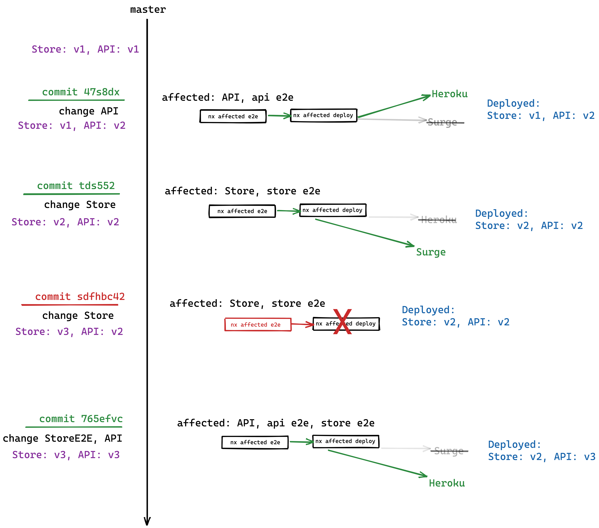

# "Last successful commit" action

This action returns the commit hash when a given workflow was last successful.

This is especially useful when we have a workflow where we need to know what changed
in on a given branch between two commits, so we can run some tasks on those
changes.

Scroll down to the **Background** section below for more info around 
why this would be useful.

## Inputs

### `branch`

**Required** Branch to get last successful commit from.
**Default**: `main`

### `github_token`

**Required** Your GitHub access token (see Usage below).

### `workflow_id`

**Required** ID or filename of the workflow (e.g. `deploy.yml`).

## Outputs

### `commit_hash`

Hash of the last successful commit.

## Example usage

```yaml
name: Deploy Website

on:
  push:
    branches:
      - main

jobs:
  build:
    runs-on: ubuntu-latest
    name: Deploying affected apps
    steps:
      - uses: actions/checkout@v1
      - uses: bahmutov/npm-install@v1.4.5
      - uses: nrwl/last-successful-commit-action@v1
        id: last_successful_commit
        with:
          branch: 'master'
          workflow_id: 'deploy.yml'
          github_token: ${{ secrets.GITHUB_TOKEN }}
      - run: npm run nx affected -- --target=build --base=${{ steps.last_successful_commit.outputs.commit_hash }} --parallel --configuration=production
```

# Background

When using a tool like [Nx](https://nx.dev/), for example, it has a feature
where you give it 2 commits, and it calculates [which projects in your repository changed
between those 2 commits](https://nx.dev/latest/angular/tutorial/11-test-affected-projects#step-11-test-affected-projects
). We can then run a set of tasks (like building or linting) only
on those **affected** projects.

This makes it easy to set-up a CI system that scales really well with the
continous growth of your repository, as you add more and more projects.


### Problem

On a CI system that runs on submitted PRs, it's easy to determine what commits to include in the **affected** calculation:
everything between latest `origin/master` and `HEAD-commit-of-my-PRs-branch`.
As that includes all the changes our PR will introduce to `master`.

But what if we want to set up a continuous deployment system
that, as changes get pushed to `master`, it builds and deploys
only the affected projects?

What are the `FROM` and `TO` commits in that case?

They can't be just `HEAD` and `HEAD~1` - as we might push a bunch
of commits into master. We want to include ALL those commits when determining
affected.

There's also the issue of failures - if a few deployments fail one after
another, that means that we're accumulating a list of affected projects
that are not getting deployed. Anytime we retry the deployment, we want to include
**every commit since the last time we deployed successfully**. That way we ensure
we don't accidentally skip deploying a project that has changed.

Here's an attempt at demonstrating the problem above:

 
